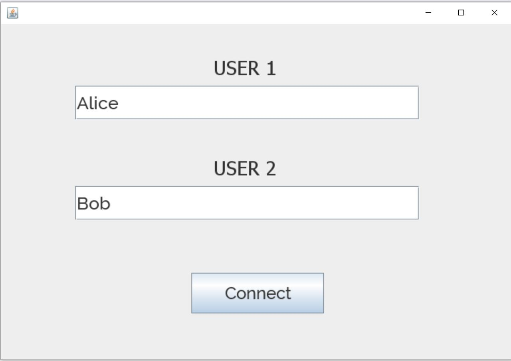
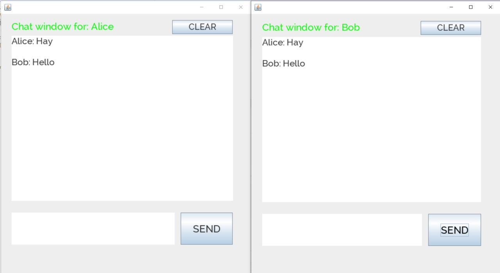

# Chat-App
Chat application in Java 8. 

For this app I used Eclipse IDE because of better code formatting and because of its more user friendly UI which offers its great functionalities. I wanted to try TestNG, therefore Eclipse was my first choice as plug-ins are easier to install within Eclipse then, lets say InteliJ.
